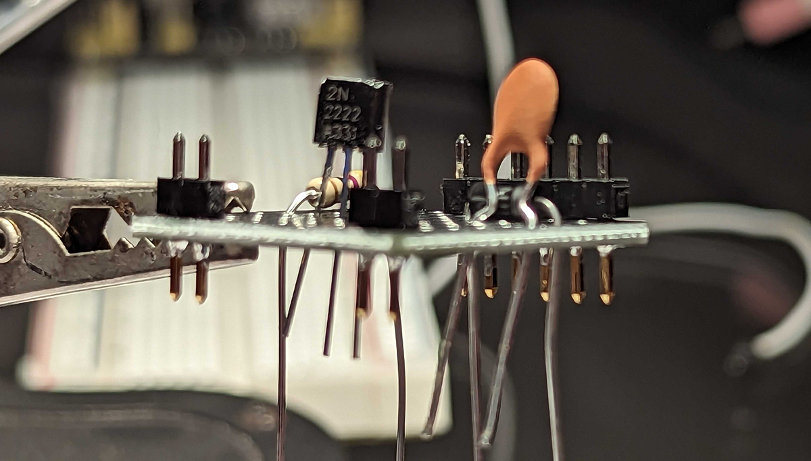

# BLE Circuit

The following parts were used to make this circuit:

- [SEEED STUDIO XIAO ESP32C3 WIFI+B](https://www.digikey.com/en/products/detail/seeed-technology-co-ltd/113991054/16652880)
- [VIBRATION ERM MTR 10000 RPM 3V](https://www.digikey.com/en/products/detail/seeed-technology-co-ltd/316040004/5487673)
- [Xiaoyztan 100 Pcs White Light LED Bead Chips DC 3.0-3.2V 280mA 1W Emitting Diodes LED Emitters (White Light)](https://www.amazon.com/gp/product/B07DWR671V/ref=ppx_yo_dt_b_asin_title_o04_s00?ie=UTF8&psc=1)
- [BOJACK 1000 Pcs 25 Values Resistor Kit 1 Ohm-1M Ohm with 5% 1/4W Carbon Film Resistors Assortment](https://www.tindie.com/products/debinix/tiny-1x1-through-hole-prototype-board/)
- [BOJACK 1N4007 Rectifier Diode 1 A 1000 V DO-41 Axial 4007 1 amp 1000 Volt Electronic Silicon Diodes(Pack of 125 Pieces)](https://www.amazon.com/gp/product/B07Q6J9TNW/ref=ppx_yo_dt_b_asin_title_o00_s00?ie=UTF8&psc=1)
- [BOJACK 2N2222 NPN 60V 0.8A 0.5W 250MHZ Power General Purpose Transistors(Pack of 200 Pcs)](https://www.amazon.com/gp/product/B07T61M92G/ref=ppx_yo_dt_b_asin_title_o03_s01?ie=UTF8&psc=1)
- [BOJACK 10 Values 300 Pcs Ceramic Capacitor 0.1 0.15 0.22 0.33 0.47 0.68 1 2.2 4.7 10 uF Multilayer Monolithic Ceramic Capacitor Assortment Kit](https://www.amazon.com/BOJACK-Capacitor-Multilayer-Monolithic-Assortment/dp/B085RDTCCV?th=1)
- [QTETAK 200 Pcs 10 Value Micro Momentary Tactile Push Button Switch Tact Assortment Kit](https://www.amazon.com/gp/product/B07LCBLB8N/ref=ppx_yo_dt_b_asin_title_o09_s00?ie=UTF8&psc=1)
- [Tiny 1”x1” Through Hole Prototype Board -- originally from Amazon, but no longer available](https://www.tindie.com/products/debinix/tiny-1x1-through-hole-prototype-board/)

These are the main steps we followed to construct this circuit:

- Utilize only one side of the ESP32 pins for simplified soldering and assembly.
- Connect pin D7 to the LED, functioning as a digital output. When set to HIGH, the LED will turn on. The SEEED XIAO-ESP32-C3 is capable of supplying the required current for the LED directly from its digital output pins.
- Power the vibration motor using the 3.3-volt output from the ESP32. Control the motor's operation through pin D8, which also serves as a digital output.

For more details:

[Sourcing parts](sourcing_parts.md)

[Constructing the circuit](building_the_circuit.md)