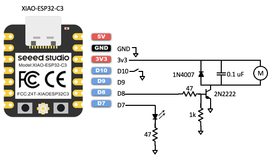
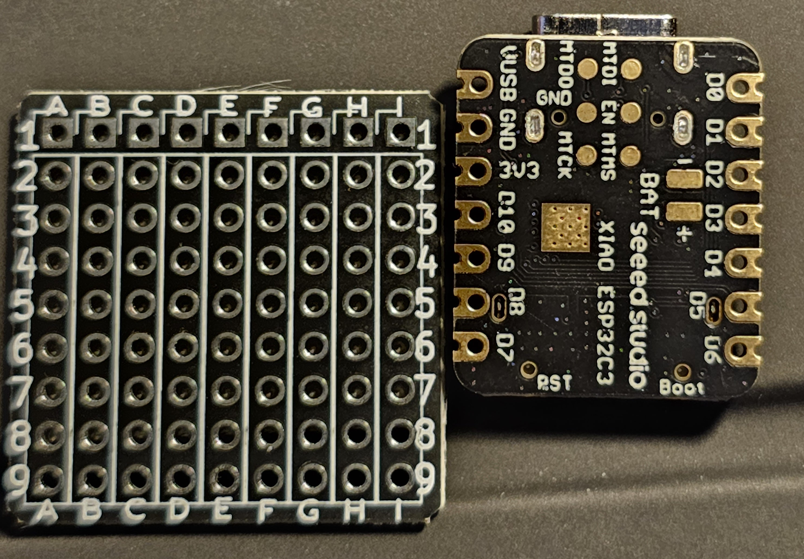
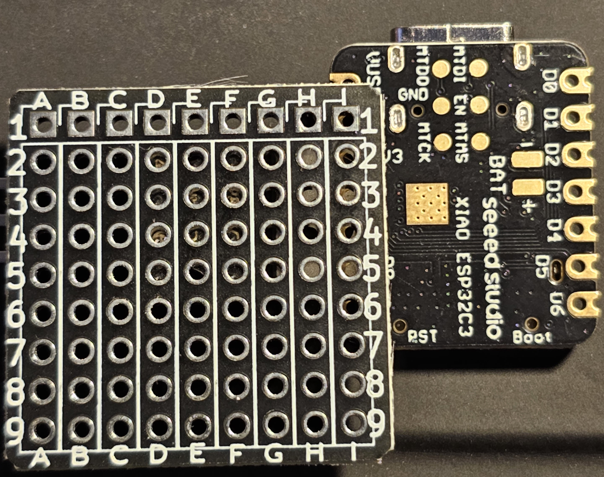
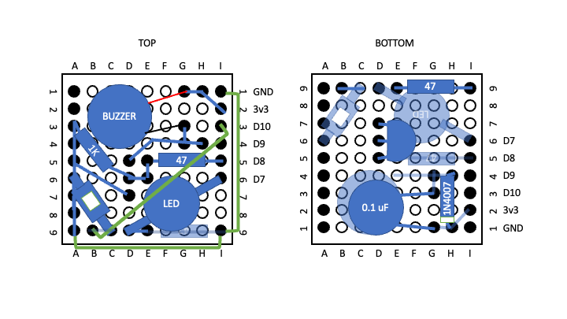

***
# Using the SEEED XIAO-ESP32-C3 as a Two-Way BLE communicator and circuit controller
***  

We used the pins from one side only of the ESP32 to make soldering and assembly easy.  

Pin D7 (as a digital output) turns the LED on when HIGH.  The SEEED XIAO-ESP32-C3 provides enough current for the LED directly from its digital output pins.

The 3.3 volt output from the ESP32 powers the vibration motor.  Operation of the motor is controlled by pin D8 (as a digital output).  

The 2N2222 transistor acts as a switch that allows current to flow from the 3.3 volt pin to ground when D8 is HIGH.  The 3.3 volt pin can source more current than the D8 pin can, which is why we used a switched circuit.  

The 1N4007 diode and 0.1 &mu;F capacitor protect the XIAO-ESP32-C3 from reverse currents that can arise when the motor shuts off.

&nbsp; 
***
### The goal of this circuit design was to create an assembly with the lowest profile possible.  
***  
&nbsp; 

The ESP32 is inverted for soldering.  The shape of the ESP32's solder pads allows for connection without wires.  

Proper clamping and use of flux when soldering permits solid, low-profile connections between the two.

After soldering, the connections between the prototype board and the  SEEED XIAO-ESP32-C3 will look like this:

Placement and connection of the components (after many iterations) ended up with the bodies of some parts on the bottom and some on the top.  Slightly transparent parts from the opposite side are depicted to limit accidental soldering where a part's body needs to be.

Column A in this figure is used as a ground plane.  The green wires from GND to I-9 and then to A-9 connect one end of the switch, 1K&Omega; resistor, and the 2N2222 transistor emitter pin (pin 1) to ground.

The orientations of the diode and transistor are key.  The diode has a silver ring around the side that should be connected to the 3.3 V pin.  The transistor's emitter pin should connect to ground.
 

