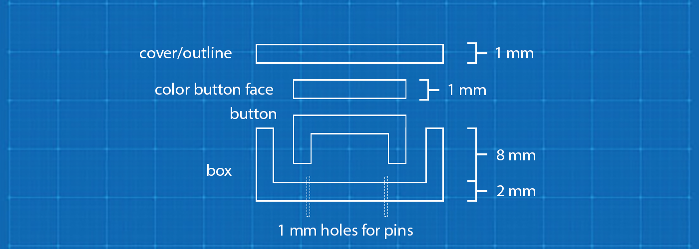

# 3D Printing a Case

Equipment list:

- [Anycubic Vyper](https://www.anycubic.com/collections/3d-printers/products/anycubic-vyper) (3d printer)

Materials:

- [Black PLA](https://www.monoprice.com/product?p_id=10551) (for the box/base and the button)
- [Silver PLA](https://www.amazon.com/dp/B07QGV6D8P) (for the top/outline of the box)
- [Red PLA](https://www.monoprice.com/product?p_id=36277) (for the top of the button)
- [Yellow PLA](https://www.amazon.com/dp/B0BCCZK7W1 ) (for the top of the button)
- [Blue PLA](https://www.amazon.com/dp/B0BCDT5BNV) (for the top of the button)
- [Tie tack and butterfly clutch](https://www.amazon.com/dp/B072B9XGZ4) (to make into pin for clothing)
- [Gorilla Clear Grip glue](https://www.gorillatough.com/product/gorilla-clear-grip/) (for gluing the color pieces to the top of the button)

Software used:

- [Sketch](https://www.sketch.com/) (vector file editor)
- [TinkerCad](https://www.tinkercad.com/) (for creating the 3d shapes)
- [IdeaMaker](https://www.raise3d.com/ideamaker/) (for slicing the 3d files for printing)

Your process will likely be different, but here is what we did to build our badge prototype:

We started by importing the basic shape that we wanted to use in Sketch. We then created different shapes to represent the bottom of the badge, the top of the badge, and the inner button. There needs to be a small amount of space around the button, or it will fit too closely within the box and not be moveable.

Then we exported the layers as svg files (vector, so they would not lose fidelity). The vector files were created around 50x50 pixels (because TinkerCad imports these at 50mm x 50mm which is our target size).

In TinkerCad, we imported each svg file. For the most part, we tried to have each layer be 2 mm high, and we made the "box" part of the 12 mm high, and the "button" part about 6 mm. We printed a layer of colored panels that were glued to the top of the button-base.

To "hollow out" the box and the button, we raised the height as mentioned above. Then we imported the appropriate "hollow" file. In TinkerCad, changing the color from `Solid` to `Hole` makes it semi-transparent. We'd move the hollow piece up 2 mm (to allow for the bottom of the container), and then we'd select both objects and group them.

With the box piece, we also dragged a hollow cylinder from the Basic Shapes list, positioned it, and made it 1mm x 1mm. We used this to drill a hole through the base, and then we copied and positioned another one. This gave us some holes that could be used to push the pin (tie tack) through the base.

Then we pulled the files into IdeaMaker (one at a time) and sliced them. Those sliced files are in the `gcode` folder - but they are specific to the printer we are using, so we recommend slicing your own files. No supports are needed, and we had 10% infill turned on, although that really doesn't make a difference for these files. 

Also (personal preference) we rotated the color files to be upside down (as well as the other files with a flat face) because the heated plate on our printer has a nice pattern that melts into the face, so it looks a little less 3d printed.

For effiency, we also printed nine at a time.

### Final Assembly and Testing

We copied the gcode files to an SD card and started printing the pieces. We used different color filaments to print each piece.

There's a bit of a learning curve when printing these. The button base was misaligned, and ended up having a hole in it and needed to be re-printed. Each piece took between 30-45 minutes to print.

Pushing the pins through the base (even with the pre-printed holes) was difficult until we figured out to use needle-nosed pliers and gently but firmly push them through.